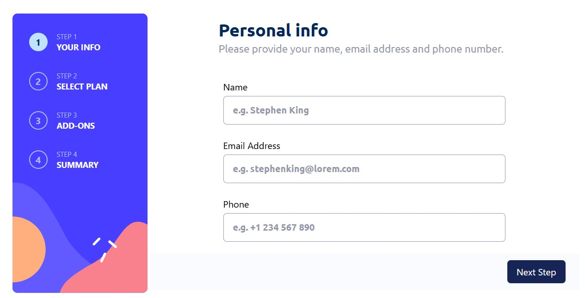
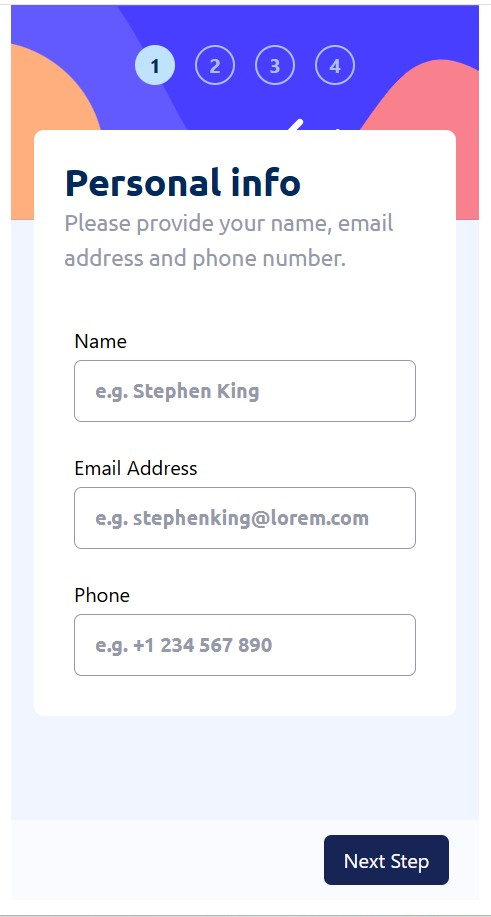

# Frontend Mentor - Multi-step form solution

This is a solution to the [Multi-step form challenge on Frontend Mentor](https://www.frontendmentor.io/challenges/multistep-form-YVAnSdqQBJ). Frontend Mentor challenges help you improve your coding skills by building realistic projects. 

## Table of contents

- [Overview](#overview)
  - [The challenge](#the-challenge)
  - [Screenshot](#screenshot)
  - [Links](#links)
- [My process](#my-process)
  - [Built with](#built-with)
  - [What I learned](#what-i-learned)
  - [Useful resources](#useful-resources)
  - [AI Collaboration](#ai-collaboration)
- [Author](#author)

**Note: Delete this note and update the table of contents based on what sections you keep.**

## Overview

### The challenge

Users should be able to:

- Complete each step of the sequence
- Go back to a previous step to update their selections
- See a summary of their selections on the final step and confirm their order
- View the optimal layout for the interface depending on their device's screen size
- See hover and focus states for all interactive elements on the page
- Receive form validation messages if:
  - A field has been missed
  - The email address is not formatted correctly
  - A step is submitted, but no selection has been made

### Screenshot

### Links

- Solution URL: [@github](https://github.com/DanielMarques1404/multi-step-form-main)
- Live Site URL: [@multi-step-form](https://multi-step-form-main-r83sdtztu-danielmarques1404s-projects.vercel.app/)

## My process

### Built with

- Semantic HTML5 markup
- CSS custom properties
- [TailwindCSS](https://tailwindcss.com/) - A utility-first CSS framework
- Mobile-first workflow
- [React](https://react.dev/) - JS library
- [Vite](https://vite.dev/) - React framework
- [React Hook Form](https://react-hook-form.com/) - Performant, flexible and extensible forms with easy-to-use validation

### What I learned

I learned how to use React Hook Forms. A very powerfull tool in this process, with many others features that I'll keep in mind in my future projects.

### Useful resources

- [React Hook Form](https://react-hook-form.com/) - This helped me in the form customization, validation and his submition process.

### AI Collaboration

Github Copilot and ChatGPT were my partners during this project. Mostly in css issues and array management for the API's responses.

## Author

- Frontend Mentor - [@DanielMarques1404](https://www.frontendmentor.io/profile/DanielMarques1404)
- LinkedIn - [@dan-marques](https://www.linkedin.com/in/dan-marques/)
